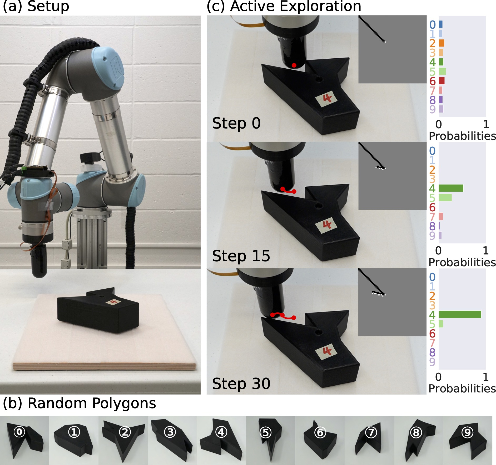
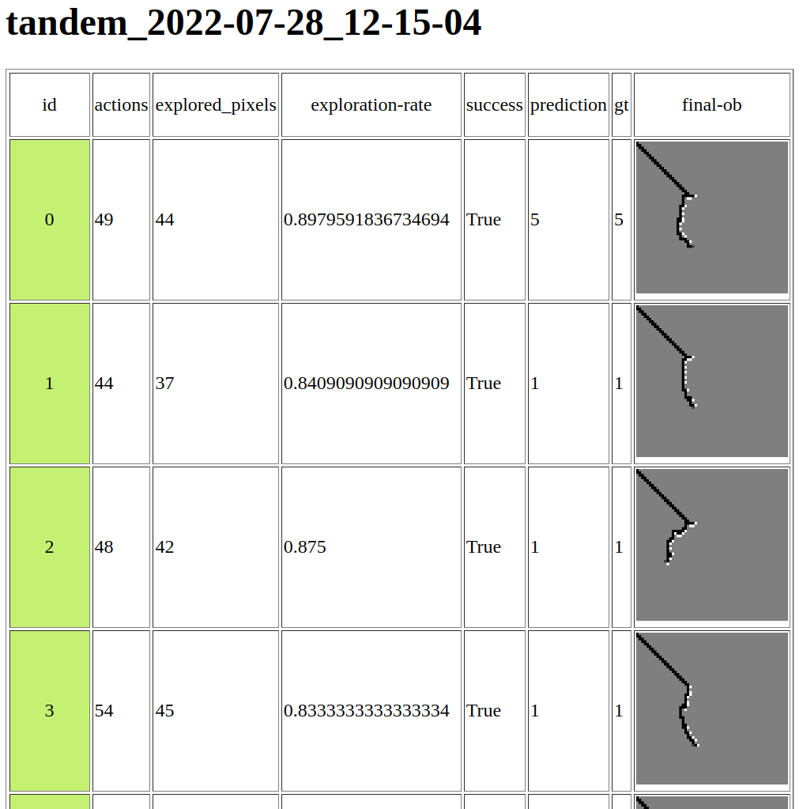

# TANDEM: Learning Joint Exploration and Decision Making with Tactile Sensors

[Jingxi Xu](https://jxu.ai/),
[Shuran Song](https://www.cs.columbia.edu/~shurans/),
[Matei Ciocarlie](https://roam.me.columbia.edu/people/matei-ciocarlie)
<br>
Columbia University
<br>
Robotics and Automation Letters (RA-L)
<br>
International Conference on Intelligent Robots and Systems (IROS) 2022

### [Project Page](https://jxu.ai/tandem) | [Video](https://youtu.be/dq1OH4xJquU) | [arXiv](https://arxiv.org/abs/2203.00798)

## Overview

This repo contains the PyTorch implementation for paper "TANDEM: Learning Joint Exploration and Decision Making with Tactile Sensors".

<p align="center">

</p>

## Content

- [Prerequisites](#prerequisites)
- [Training](#training)
- [Testing](#testing)
- [Real-robot](#real-robot)
- [BibTex](#bibtex)

## Prerequisites

We have prepared a conda YAML file which contains all the python dependencies.

```sh
conda env create -f environment.yml
```

To activate this conda environment,

```sh
conda activate tandem
```

## Training

To train _TANDAM_,

```sh
python train_rl_ppo.py \
--exp_name tandom_noise_0005 \
--discriminator learned \
--train_discriminator \
--save_length 100 --save_success 0.90 \
--sensor_noise 0.005
```

To train the _All-in-one_ baseline,

```sh
python train_rl_ppo.py \
--exp_name all_in_one_noise_0005 \
--save_length 1000 --save_success 0.40 --save_interval 500 \
--use_correctness \
--all_in_one \
--sensor_noise 0.005 \
--num_envs 8
```

To train the _PPO-ICP_ baseline,

```sh
python train_rl_ppo.py \
--exp_name ppo_icp_noise_0005 \
--discriminator icp \
--train_discriminator false \
--save_length 2000 --save_success 0.2 \
--sensor_noise 0.005
```

To train the _Edge-follower_ baseline,

```sh
python train_discriminator_with_fixed_explorer.py \
--exp_name edge_follower_noise_0 \
--discriminator learned \
--train_discriminator \
--save_length 100 --save_success 0.9 --save_interval 500 \
--explorer_type edge --discriminator_epochs 5
```

To train the _Info-gain_ baseline,

```sh
python train_discriminator_with_fixed_explorer.py \
--exp_name info_gain_noise_0005 \
--discriminator learned \
--train_discriminator \
--save_length 2000 --save_success 0.4 --save_interval 500 \
--explorer_type info \
--sensor_noise 0.005 \
--discriminator_epochs 5
```

To train the _Not-go-back_ baseline,

```sh
python train_discriminator_with_fixed_explorer.py \
--exp_name not_go_back_noise_0005 \
--discriminator learned \
--train_discriminator \
--save_length 2000 --save_success 0.2 --save_interval 500 \
--explorer_type not_go_back \
--sensor_noise 0.005 \
--discriminator_epochs 5
```

To train the _Random-walk_ baseline,

```sh
python train_discriminator_with_fixed_explorer.py \
--exp_name random_noise_0005 \
--discriminator learned \
--train_discriminator \
--save_length 2000 --save_success 0.2 --save_interval 500 \
--explorer_type random \
--sensor_noise 0.005 \
--discriminator_epochs 5
```

We uses [wandb](https://wandb.ai) to log the training stats. After the training starts, a folder named `models/[EXP_NAME]_[HOST_NAME]_[DATE]_[TIME]` will be created where all the checkpoints, metadata, training stats. command, and log are saved.

We provide `evaluate_models.py` to select and view the top models with best training performance based on a specific metric.

```sh
python evaluate_models.py \
--save_dir models/[EXP_NAME]_[HOST_NAME]_[DATE]_[TIME] \
--top 10 --metric running_length \
--dry_run
```

## Testing

We have provided a script to evaluate the saved model checkpoints `enjoy_floating_finger.py`. We also provide some pre-trained models under `assets/models`.

To enjoy the pre-trained _TANDEM_ model,

```sh
python enjoy_floating_finger.py \
--discriminator learned \
--discriminator_path assets/models/tandem_noise_0005/model.pth \
--explorer ppo \
--explorer_path assets/models/tandem_noise_0005/explorer_model.pth \
--sensor_noise 0.005 \
--save_npy --exp_name tandem \
--render_pybullet --render_ob
```

To enjoy the pre-trained _Edge-follower_ model,

```sh
python enjoy_floating_finger.py \
--discriminator learned \
--discriminator_path assets/models/edge_follower_noise_0/model.pth \
--explorer edge \
--sensor_noise 0.005 \
--save_npy --exp_name edge \
--render_pybullet --render_ob
```

You can remove `--render_pybullet --render_ob` to run headless without pybullet and occupancy grid visualization.

This script will create a folder named `[EXP_NAME]_[DATE]_[TIME]`. You can visualize the table of results and final occupancy grid visualization at termination by opening `[EXP_NAME]_[DATE]_[TIME]/html/index.html` with your browser. It should look like the below screenshot.

<p align="center">

</p>

_Note that even though we have set the seed, it is still possible to observe slightly different results across different machines. But the results should be consistent and reproducible with the same seed on the same machine._

## Real-robot

We use the UR5 robotic arm and the [DISCO tactile finger](https://arxiv.org/abs/2004.00685) developed in [ROAM Lab](https://roam.me.columbia.edu/) at Columbia University. The DISCO finger is not publicly available. But if you are interested in getting one, please contact [Jingxi Xu](https://jxu.ai). We use the [ur_rtde](https://sdurobotics.gitlab.io/ur_rtde/) package for UR5 control. We also provide the CAD models of the finger coupler that connects the finger base to the UR5 arm.

The code for real robot experiments can be found in `/real_robot`. All 30 real robot experiment stats/log (shown in Table II and Fig. 5 in the paper) can be found in `/real_robot/real_exp`.

When you have the UR5 and DISCO finger set up, spin up one trial on the real robot with,

```sh
cd real_robot
python real_enjoy_floating_finger.py \
--discriminator_path ../assets/models/tandem_noise_0005/model.pth \
--explorer_path ../assets/models/tandem_noise_0005/explorer_model.pth  \
--polygon_id [GROUND TRUTH POLYGON ID] \
# How much steps to fast-forward/teleport the finger towards the center of the workspace
--jumpstart_move 30
```

## BibTeX

If you find this repo useful, please consider citing,

```
@article{xu2022tandem,
  title={TANDEM: Learning Joint Exploration and Decision Making with Tactile Sensors},
  author={Xu, Jingxi and Song, Shuran and Ciocarlie, Matei},
  journal={IEEE Robotics and Automation Letters},
  year={2022},
  publisher={IEEE}
}
```
